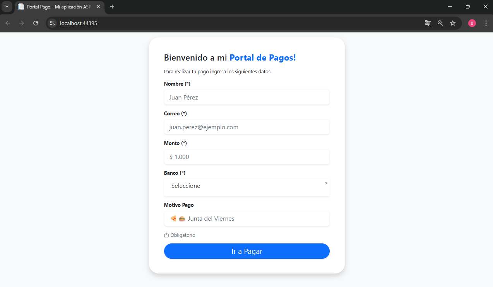
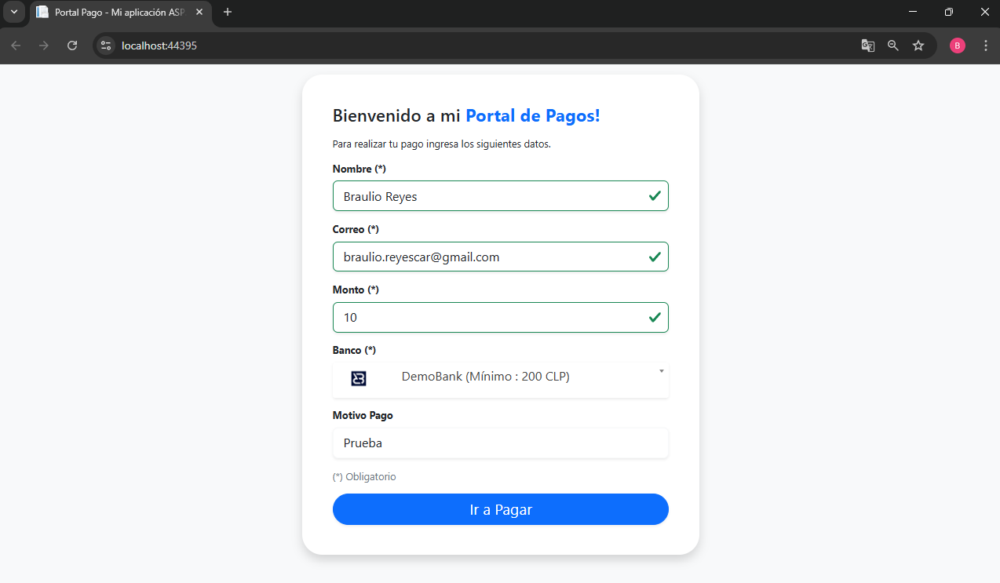
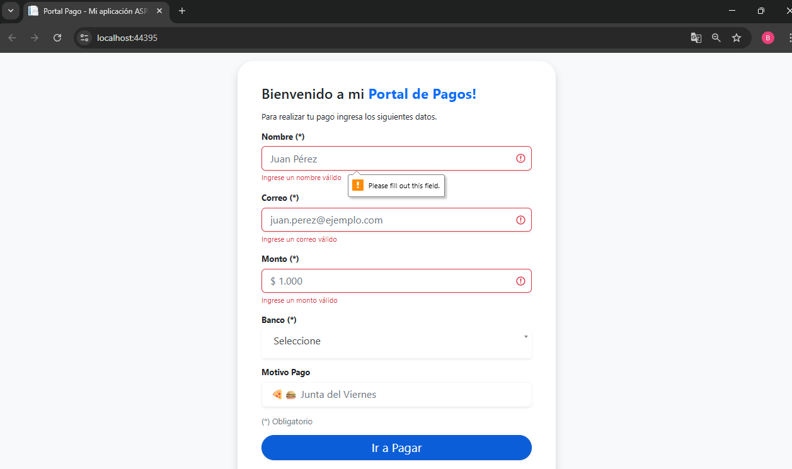
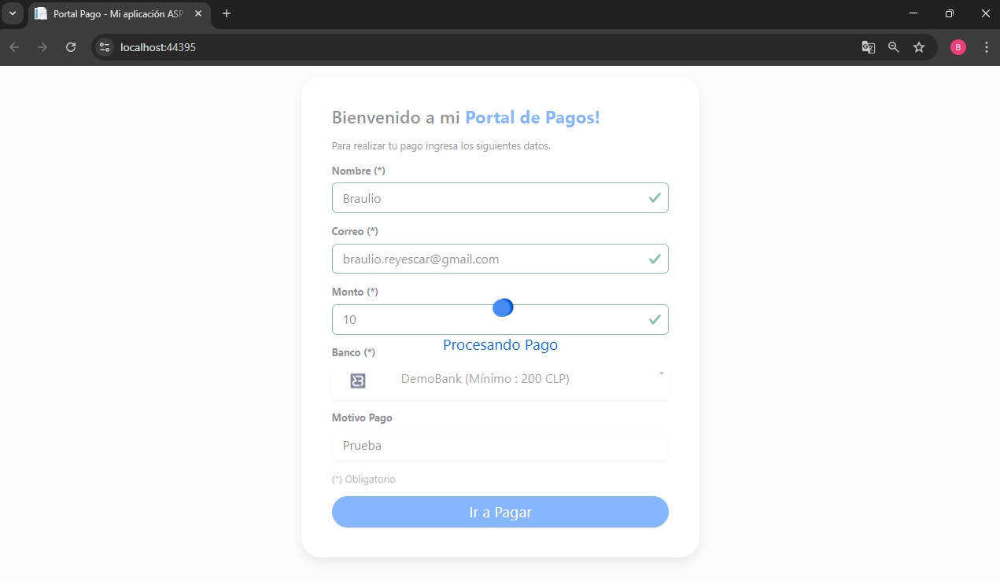
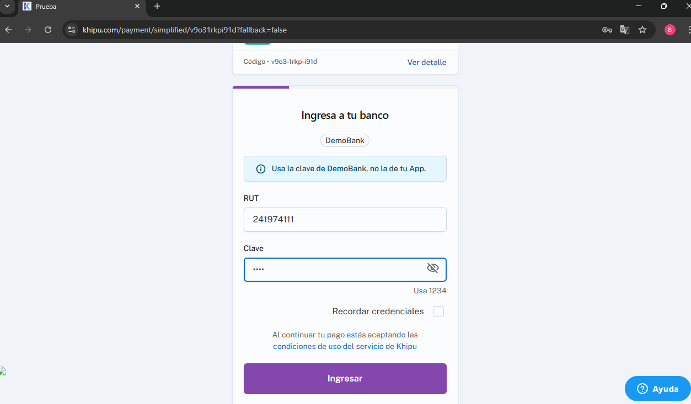
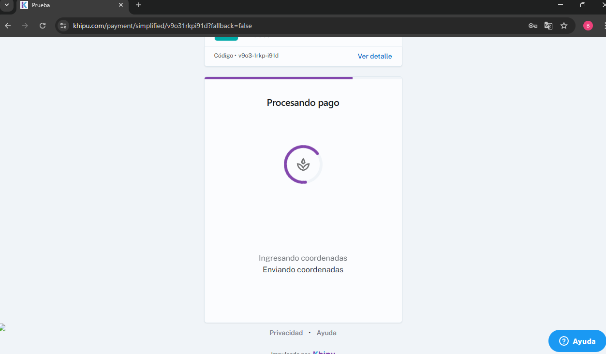
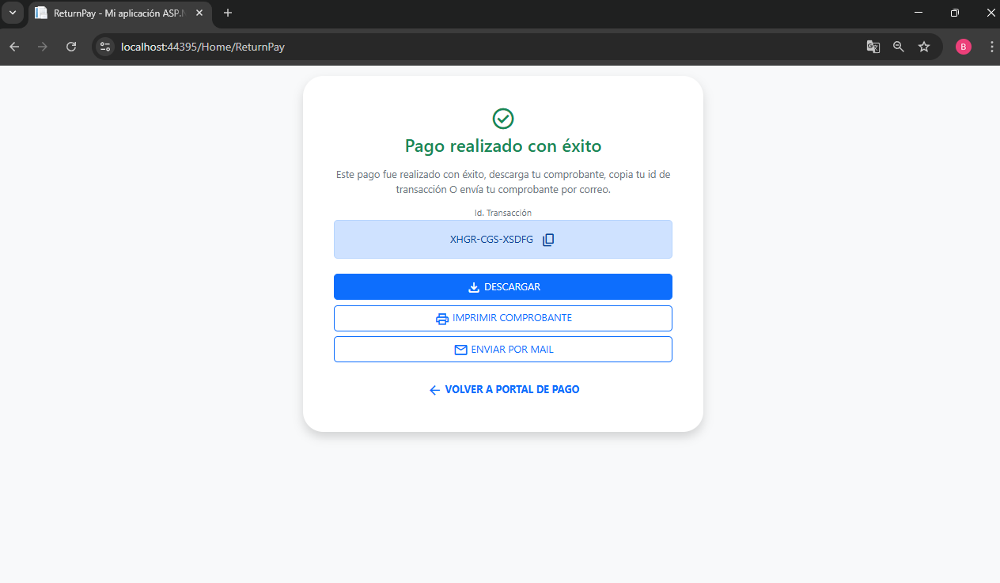
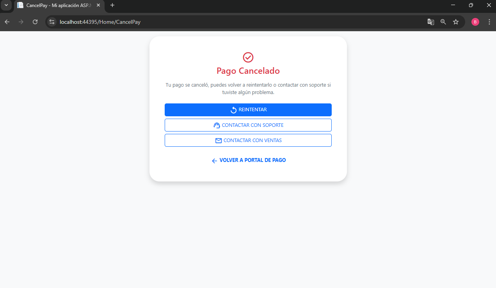

# IntegracionKhipu

Este proyecto permite generar cobros automáticos usando la API de Khipu y redirige al usuario a una página de éxito tras completar el pago.

## 🚀 Tecnologías utilizadas

- .NET Framework
- C#
- Vue.js
- JavaScript
- Postman

## ✅ Requisitos previos

- [Visual Studio](https://visualstudio.microsoft.com/)
- .NET Framework compatible con el proyecto

## ⚙️ Instalación y ejecución

1. Clona el repositorio o descarga el proyecto.
2. Abre el archivo `IntegracionKhipu.sln` con Visual Studio.
3. Ejecuta el siguiente comando en la Consola del Administrador de Paquetes para resolver un error común relacionado con Roslyn:

   ```
   Update-Package Microsoft.CodeDom.Providers.DotNetCompilerPlatform -r
   ```

4. Ejecuta el proyecto desde Visual Studio.

## 🔐 Configuración de Khipu

Las credenciales de la API de Khipu (como el `receiver_id` y `secret`) se encuentran configuradas dentro del archivo `web.config`. Asegúrate de tener tus datos de Khipu correctamente ingresados ahí antes de ejecutar el proyecto.

## 🔄 Flujo del cobro

1. El sistema consume el endpoint `[get_banks](https://payment-api.khipu.com/v3/banks)` de la API de Khipu para obtener las opciones bancarias disponibles.
2. Luego, se ejecuta el endpoint `[create_payment](https://payment-api.khipu.com/v3/payments)` para generar el cobro.
3. El usuario es redirigido a Khipu para completar el pago.
4. Tras finalizar, el usuario es enviado de vuelta a una **página de éxito** dentro del mismo sistema y usando el endpoint `[Get_payment_by_Id](https://payment-api.khipu.com/v3/payments/{id})` para obtener el estado del pago.

## 👤 Autor

**Braulio Reyes**

## 🖼️ Capturas de pantalla

### Página de inicio


### Validaciones de Formulario



### Procesando Pago y Redireccionando a Khipu


### Completando Proceso de Pago en Khipu



### Vistas Finales




> Este proyecto fue desarrollado como una integración directa con la API de pagos de [Khipu](https://khipu.com/), facilitando el proceso de cobro automatizado en aplicaciones web basadas en .NET.
